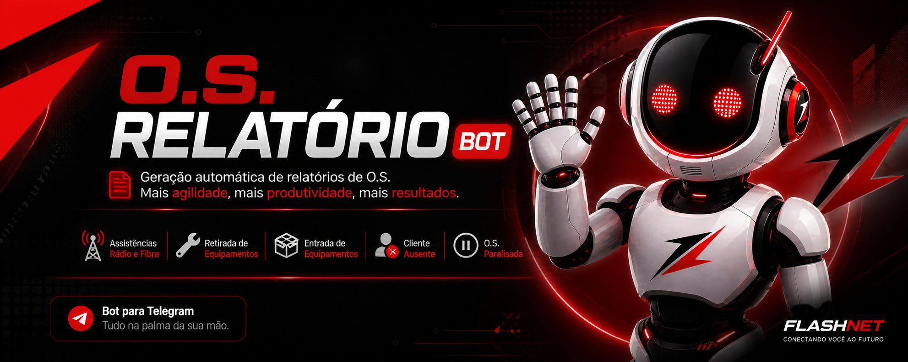

  

# 🚀 Sistema Flash Reports v8

Sistema automatizado de geração de relatórios de O.S. via Telegram, desenvolvido para padronizar atendimentos técnicos, reduzir erros e aumentar a produtividade da equipe de campo.

---

## 🎯 Objetivo

* ⚡ Reduzir tempo de preenchimento
* 📋 Padronizar relatórios técnicos
* ❌ Diminuir erros humanos
* 📡 Melhorar comunicação interna
* 📊 Organizar o fluxo operacional

---

## 🧠 Evolução até a v8

A versão v8 é uma evolução direta das versões anteriores, com foco em:

✔ Padronização completa dos dados  
✔ Interface interativa (menos chat, mais sistema)  
✔ Redução extrema de digitação  
✔ Melhor experiência do técnico  
✔ Fluxo automatizado e limpo  

---

## ⚙️ Funcionalidades

### 📋 Módulos

* 🔧 Assistências
* 📦 Retirada
* 🏢 Estoque
* 🚫 Cliente ausente
* ⏸️ O.S. paralisada
* 📋 Pendências

---

## 📡 Assistências (v7)

* Modelos completos (rádio, fibra, segundo ponto, etc.)
* Campos inteligentes e condicionais
* Padronização com botões
* Relatório final estruturado

### 🔧 Novidades v7

* Tipo de roteador principal:
  * Comodato
  * Próprio (Cliente)

* Tipo de roteador do segundo ponto:
  * Comodato
  * Próprio (Cliente)
  * Locação
  * Não possui

* Fixação com botões:
  * Sobre o móvel
  * Bucha e parafuso
  * Parede
  * Suporte
  * Outro

* Configuração com botões:
  * Configuração padrão
  * Ajuste de Wi-Fi
  * Reset + reconfiguração
  * Troca de senha
  * Outro

---

## 📦 Sistema de Materiais (v8)

Fluxo completamente reformulado:

* Seleção por categoria
* Seleção por subcategoria (modelo/tipo)
* Controle de quantidade com botões
* Prévia em tempo real dos materiais adicionados

Exemplo:

📦 Materiais adicionados:
1x TP-Link AX3000
2x Conector APC

---

## ➕ Quantidade interativa (v8)

[ - ] 1 [ + ]  
[ Adicionar ]

* Sem digitação  
* Resposta instantânea  
* Mais precisão  

---

## 🧹 Limpeza automática do atendimento (v8)

Após finalizar um relatório:

* Todas as mensagens do fluxo são removidas  
* Perguntas e respostas são apagadas  
* Botões antigos desaparecem  

Mantém apenas:

/start  
Relatório enviado com sucesso  

---

## 📦 Retirada

Fluxo guiado:

* Pergunta sobre roteador  
* Lista modelos cadastrados  
* Pergunta sobre ONU  
* Pergunta sobre patchcord  
* Observação com botão  

---

## 🏢 Estoque

Fluxo padronizado:

* Tipo de retirada  
* Equipamentos recebidos  
* Destino automático  
* Recebedor  
* Cidade  

---

## 🔁 Integração Retirada → Estoque

Após finalizar retirada:

Deseja gerar entrada no estoque?

* Dados reaproveitados automaticamente  
* Continuidade do fluxo  

---

## 📋 Pendências

Registro automático de:

* O.S. paralisada  
* Cliente ausente  

### Comandos:

/pendencias  
/baixar_pendencia 123456  

---

## ⚙️ /config

Gerencia:

* Técnicos  
* Roteadores  
* ONU  
* Locais  
* Materiais  
* Energia  
* Textos rápidos  
* Estoques  

✔ Sincronizado entre todos usuários  

---

## 🧾 Relatórios

* Estrutura formal automática  
* Organização por seções  
* Dados padronizados  
* Envio direto ao grupo  

Inclui:

Início  
Fim automático  
Tempo gasto  
Técnicos  
Equipamentos  
Materiais  

---

## ⏱️ Tempo automático

* Técnico informa apenas início  
* Final automático  
* Tempo calculado automaticamente  

---

## 📂 Estrutura

core/  
shared/  
models/  
data/  

main.py  
config.py  
requirements.txt  
README.md  

---

## 🔐 Variáveis

BOT_TOKEN=SEU_TOKEN  
CHAT_ID=ID_DO_GRUPO  
CONFIG_PASSWORD=SENHA  

---

## 🚀 Deploy

git add .  
git commit -m "feat: v8"  
git push origin main  

---

## 🧪 Comandos

/start  
/assistencia  
/retirada  
/estoque  
/ausente  
/paralisada  
/pendencias  
/baixar_pendencia  
/config  

---

## 🔮 Próximos passos

* Motor inteligente (padronização automática de textos)  
* Dashboard web  
* Estatísticas de atendimento  
* Histórico por O.S.  
* Integração com sistemas externos  

---

## 👨‍💻 Desenvolvedor

Cauã Henrique de Oliveira  

---

## 🧠 Filosofia

Menos digitação,  
menos erro,  
mais produtividade.
